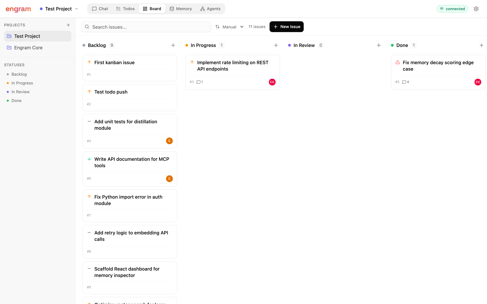
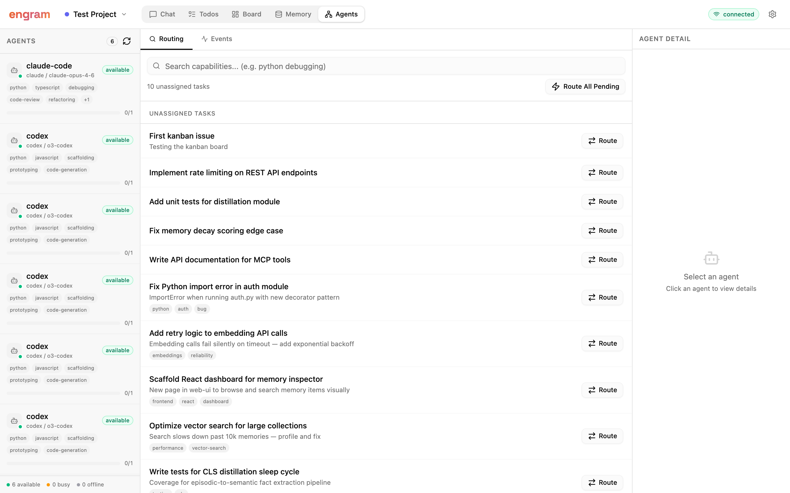
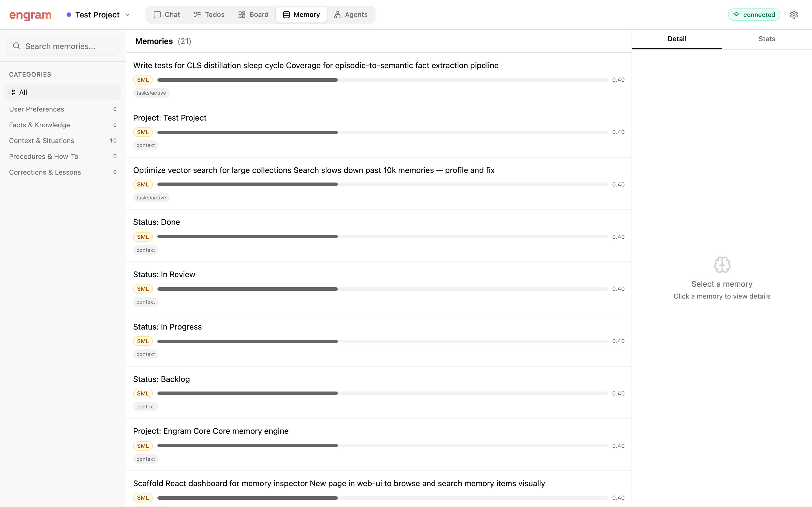
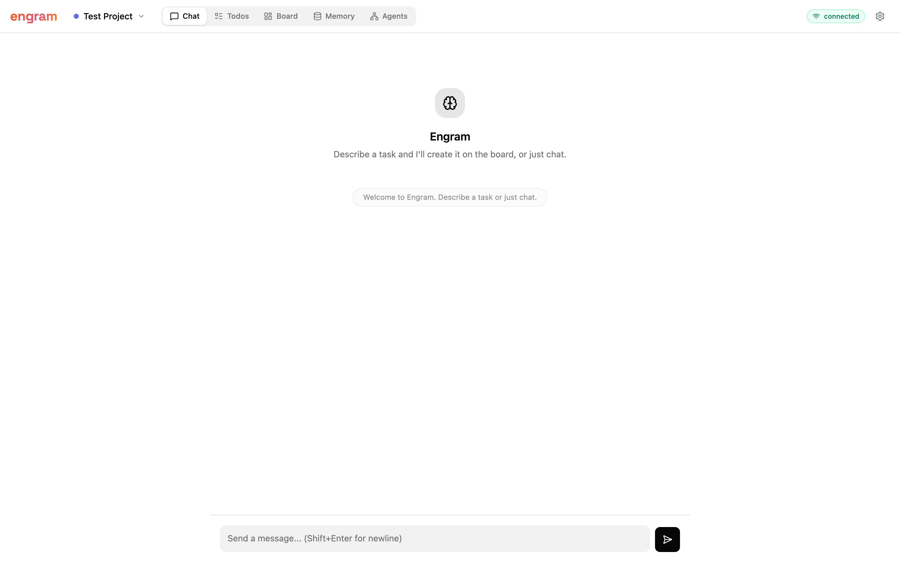

<h1 align="center">
  <br>
  
  <br>
  Engram
  <br>
</h1>

<h3 align="center">
  The Personal Memory Kernel for AI Agents
</h3>

<p align="center">
  Hit a rate limit in Claude Code? Open Codex — it already knows what you were doing.<br>
  Create a task? Memory picks the best agent automatically.<br>
  One memory kernel. Shared across every agent. Bio-inspired forgetting. Zero cold starts.
</p>

<p align="center">
  <a href="https://pypi.org/project/engram-memory"></a>
  <a href="https://github.com/Ashish-dwi99/Engram/blob/main/LICENSE"></a>
  <a href="https://github.com/Ashish-dwi99/Engram/actions"></a>
  <a href="https://github.com/Ashish-dwi99/Engram"></a>
</p>

<p align="center">
  <a href="#quick-start">Quick Start</a> &middot;
  <a href="#why-engram">Why Engram</a> &middot;
  <a href="#how-it-works">How It Works</a> &middot;
  <a href="#packages">Packages</a> &middot;
  <a href="https://github.com/Ashish-dwi99/Engram/blob/main/CHANGELOG.md">Changelog</a> &middot;
  <a href="https://github.com/Ashish-dwi99/Engram/wiki">Docs</a>
</p>

---

### Dashboard

<p align="center">
  
  <br>
  <em>Kanban board — drag-and-drop task management across statuses</em>
</p>

<p align="center">
  
  <br>
  <em>Agents tab — memory-based orchestration with semantic routing and capability matching</em>
</p>

<details>
<summary><b>More views</b></summary>

<p align="center">
  
  <br>
  <em>Memory browser — search, inspect, and manage the shared memory store</em>
</p>

<p align="center">
  
  <br>
  <em>Chat — describe a task and the agent creates it on the board, or just chat</em>
</p>

</details>

---

### Research Highlights

<p align="center">
  <b>~45% less storage</b> &nbsp;&nbsp;|&nbsp;&nbsp; <b>+26% retrieval accuracy</b> &nbsp;&nbsp;|&nbsp;&nbsp; <b>+12% multi-hop reasoning</b>
</p>

<p align="center">
  Based on <a href="https://arxiv.org/abs/2601.18642"><b>FadeMem</b> (arXiv:2601.18642)</a> — biologically-inspired forgetting for efficient agent memory.
</p>

---

## Quick Start

```bash
pip install engram-memory          # 1. Install
export GEMINI_API_KEY="your-key"   # 2. Set one key (or OPENAI_API_KEY, NVIDIA_API_KEY)
engram install                     # 3. Auto-configure Claude Code, Cursor, Codex
```

Restart your agent. Done — it now has persistent memory across sessions and agents.

**Want the dashboard + orchestration?**

```bash
pip install -e "./engram-orchestrator"
pip install -e "./engram-bridge[web,orchestrator]"
engram-bridge --channel web        # Open http://127.0.0.1:8200
```

---

## Why Engram

Every AI agent you use starts with amnesia. But the real pain isn't just forgetting — it's what happens when you **switch agents** and when you have to **decide which agent to use**.

### The cold-start problem

You're 40 minutes into a refactor with Claude Code. You've touched six files, picked a migration strategy, mapped out the remaining TODOs. Then you hit a rate limit. Or your terminal crashes. Or you just need Codex for the next part. So you switch — and the new agent has **zero context**. You re-paste file paths, re-explain decisions, re-describe the plan. Half the time the new agent contradicts something you'd already decided.

### The routing problem

You have three agents configured: Claude Code for deep reasoning, Codex for fast scaffolding, a custom agent for CI. A bug comes in. Which agent handles it? You pick manually every time. When agents finish, the next task sits idle until you notice. You are the orchestrator — and you shouldn't have to be.

**Engram fixes both.** It's a Personal Memory Kernel — one memory store shared across all your agents.

**For handoffs**: when Claude Code pauses, it saves a session digest. When Codex picks up, it loads that digest and continues where you left off. No re-explanation. No cold starts.

**For orchestration**: agents register their capabilities as memories. When a task arrives, Engram semantically matches it against agent capabilities and auto-routes it to the best available agent. Memory *is* the orchestrator — no separate routing service, no manual assignment, no YAML configs mapping tasks to agents.

| Problem | Typical approach | Engram |
|:--------|:-----------------|:-------|
| **Switch agents = cold start** | Manual copy-paste | Handoff bus — auto session digests + resume |
| **Who handles this task?** | You pick manually | Semantic capability matching — auto-route |
| **Agent at capacity?** | Task sits idle | Load-aware routing with CAS claim/release |
| **Nobody forgets** | Store everything forever | Ebbinghaus decay — ~45% less storage |
| **Single retrieval path** | One embedding per memory | 5 retrieval paths per memory (EchoMem) |
| **No episodic memory** | Vector search only | CAST scenes — time/place/topic clustering |
| **No consolidation** | Store everything as-is | CLS sleep cycles — episodic to semantic distillation |
| **No real-time coordination** | Polling or nothing | Active memory signal bus — agents see each other instantly |
| **Concurrent access** | Single-process locks | sqlite-vec WAL — multiple agents, one DB |

---

## How It Works

Engram has three layers — memory, coordination, and communication:

### Passive Memory — the long-term store

Memories fade via Ebbinghaus decay, get promoted from short-term to long-term through repeated access, and are encoded through multiple retrieval paths (paraphrase, keywords, implications, question-form). Sleep cycles distill episodic conversations into durable semantic facts.

### Active Memory — the real-time signal bus

Agents post ephemeral state ("editing auth.py", "build failing") that other agents see instantly. Signals auto-expire. Important ones get consolidated into long-term storage.

### Memory-as-Orchestrator — the coordination layer

Agent capabilities are stored as memories: *"claude-code: Advanced coding agent. Expert at Python, TypeScript, debugging."* When a task arrives, Engram runs a semantic search over these capability memories, filters by agent availability and capacity, scores candidates, and assigns the task — all through the same memory infrastructure used for everything else. Coordination events (routed, claimed, released) are themselves stored as memories, creating a searchable audit trail.

No new database tables. No separate routing service. The same `Memory.add()` / `Memory.search()` that stores user conversations also stores agent profiles and routes tasks.

### Handoff

When an agent pauses (rate limit, crash, tool switch), it saves a session digest: task summary, decisions made, files touched, TODOs remaining. The next agent loads it and continues. If no digest was saved, Engram falls back to parsing the conversation logs automatically.

<details>
<summary><b>The memory stack at a glance</b></summary>

| Layer | What it does |
|:------|:-------------|
| **FadeMem** | Ebbinghaus-curve decay, SML/LML dual layers, promotion on access |
| **EchoMem** | 5 retrieval paths per memory (paraphrase, keywords, implications, Q-form) |
| **CategoryMem** | Auto-discovered hierarchical categories with retrieval boosting |
| **CAST Scenes** | Episodic narrative memory — time, place, topic clustering |
| **CLS Distillation** | Sleep-cycle replay: episodic to semantic fact extraction |
| **Multi-trace** | Benna-Fusi model — fast/mid/slow decay traces per memory |
| **Intent routing** | Episodic vs semantic query classification |
| **Orchestrator** | Agent registry + semantic task routing + CAS claim/release |
| **Handoff bus** | Session digests, checkpoints, JSONL log fallback |
| **Active Memory** | Real-time signal bus with TTL tiers |
</details>

---

## Packages

Engram is five pip-installable packages:

```
engram-memory ← engram-bus ← engram-orchestrator ← engram-bridge ← engram-enterprise
   (core)        (comms)       (routing)             (dashboard)     (governance)
```

### [`engram-memory`](./engram/) — Core Memory Engine

The main package. Memory CRUD, semantic search, decay, echo encoding, categories, episodic scenes, MCP server, CLI.

```bash
pip install engram-memory
pip install "engram-memory[openai]"     # OpenAI provider
pip install "engram-memory[ollama]"     # Ollama (local, no key needed)
pip install "engram-memory[all]"        # everything
```

```python
from engram import Engram

memory = Engram()
memory.add("User prefers Python over TypeScript", user_id="u1")
results = memory.search("programming preferences", user_id="u1")
```

**18 MCP tools** — memory CRUD, semantic search, episodic scenes, profiles, decay, session handoff. One command configures Claude Code, Cursor, and Codex:

```bash
engram install
```

### [`engram-bus`](./engram-bus/) — Agent Communication Bus

Real-time agent-to-agent coordination. Key/value with TTL, pub/sub messaging, handoff sessions and checkpoints. Zero external dependencies — stdlib only.

```bash
pip install engram-bus
```

```python
from engram_bus import Bus

bus = Bus()
bus.put("status", "refactoring auth", agent="planner", ttl=300)
bus.publish("progress", {"step": 3, "total": 5}, agent="worker")
```

[Full documentation →](./engram-bus/README.md)

### [`engram-orchestrator`](./engram-orchestrator/) — Memory-as-Orchestrator

Agents register capabilities as memories. Tasks auto-route to the best agent via semantic search. No new DB tables — everything is a memory.

```bash
pip install -e "./engram-orchestrator"
```

```python
from engram_orchestrator import Coordinator, AgentRegistry
from engram.memory.main import Memory
from engram_bus import Bus

memory = Memory(config=...)
bus = Bus()
coordinator = Coordinator(memory, bus, config)

# Agents register capabilities — stored as searchable memories
coordinator.registry.register(
    "claude-code",
    capabilities=["python", "typescript", "debugging", "code-review"],
    description="Advanced coding agent for deep reasoning tasks",
    agent_type="claude", model="claude-opus-4-6",
)

# Tasks auto-route via semantic matching
coordinator.start()  # subscribes to bridge.task.created bus events

# Or route manually
coordinator.router.route(task_id)           # single task
coordinator.router.route_pending()          # batch all unassigned

# Agents claim tasks atomically (CAS)
coordinator.claim(task_id, "claude-code")   # returns None if already claimed
coordinator.release(task_id, "claude-code")
```

Three classes, one idea:

| Class | Purpose |
|:------|:--------|
| **AgentRegistry** | Store/query agent capability profiles as `memory_type="agent"` memories |
| **TaskRouter** | Build query from task → semantic search → filter by availability → score → assign |
| **Coordinator** | Ties registry + router + bus events. CAS claim/release. Event logging as memories |

### [`engram-bridge`](./engram-bridge/) — Dashboard + Channel Adapters

Talk to your coding agents from a browser or Telegram. Kanban board, task management, live WebSocket streaming, and the coordination dashboard.

```bash
pip install -e "./engram-bridge[web,orchestrator]"
engram-bridge --channel web
```

The web dashboard at `http://127.0.0.1:8200` includes:

- **Board** — Kanban with drag-and-drop, projects, statuses, tags
- **Agents** — Coordination dashboard: agent registry, semantic routing, event log
- **Memory** — Browse and search the memory store
- **Chat** — Direct agent interaction with live streaming

> See [screenshots above](#dashboard) for a visual tour.

7 coordination REST endpoints under `/api/coordination/`:

| Endpoint | Description |
|:---------|:------------|
| `GET /agents` | List agents with capabilities + status |
| `POST /agents/{name}/register` | Register/update capabilities |
| `GET /agents/match?q=...` | Semantic capability search |
| `POST /route/{task_id}` | Route task to best agent |
| `POST /route-pending` | Batch-route all unassigned |
| `POST /claim/{task_id}` | Atomic CAS claim |
| `GET /events` | Coordination event log |

[Full documentation →](./engram-bridge/README.md)

### [`engram-enterprise`](./engram-enterprise/) — Governance Layer

Policy enforcement, provenance tracking, acceptance gates, async operations, and authenticated REST API. Built on top of engram-memory and engram-bus.

```bash
pip install engram-enterprise
```

```python
from engram_enterprise import PersonalMemoryKernel

kernel = PersonalMemoryKernel()
```

[Full documentation →](./engram-enterprise/README.md)

---

## Integrations

```bash
engram install    # auto-configures everything
```

One command sets up MCP config for Claude Code, Cursor, and Codex. It also deploys the **Claude Code plugin** — a hook that proactively injects relevant memories before every prompt, plus periodic background checkpoints that survive rate limits.

Works with any tool-calling agent via REST: `engram-api` starts a server at `http://127.0.0.1:8100`.

---

## Repo Structure

```
├── engram/                  # engram-memory — core Python package
│   ├── core/                #   decay, echo, category, scenes, distillation, traces
│   ├── memory/              #   Memory class (orchestrates all layers)
│   ├── llms/                #   LLM providers (gemini, openai, nvidia, ollama)
│   ├── embeddings/          #   embedding providers
│   ├── vector_stores/       #   sqlite-vec, in-memory
│   ├── db/                  #   SQLite persistence
│   ├── api/                 #   REST API endpoints
│   ├── mcp_server.py        #   MCP server (18 tools)
│   └── cli.py               #   CLI interface
├── engram-bus/              # engram-bus — agent communication
│   └── engram_bus/          #   bus, pub/sub, handoff store, TCP server
├── engram-orchestrator/     # engram-orchestrator — memory-as-orchestrator
│   └── engram_orchestrator/ #   registry, router, coordinator
├── engram-bridge/           # engram-bridge — dashboard + channel adapters
│   └── engram_bridge/       #   bridge, channels (web + telegram), coordination shim
│       └── channels/web-ui/ #   React dashboard (Vite + shadcn/ui)
├── engram-enterprise/       # engram-enterprise — governance layer
│   └── engram_enterprise/   #   kernel, policy, provenance, async, API + auth
├── plugins/                 # Claude Code plugin (hooks, commands, skill)
├── tests/                   # Test suite (300+ tests)
├── pyproject.toml           # engram-memory package config
└── install.sh               # One-line installer
```

---

## Contributing

```bash
git clone https://github.com/Ashish-dwi99/Engram.git
cd Engram

# Core
pip install -e ".[dev]"
pytest

# Bus
pip install -e "./engram-bus[dev]"
cd engram-bus && pytest

# Orchestrator
pip install -e "./engram-orchestrator"

# Bridge (web dashboard)
pip install -e "./engram-bridge[web,orchestrator]"
cd engram-bridge/engram_bridge/channels/web-ui && npm install && npm run build

# Enterprise
pip install -e "./engram-enterprise[dev]"
cd engram-enterprise && pytest
```

---

## License

MIT — see [LICENSE](LICENSE).

---

<p align="center">
  <b>One memory. Every agent. Zero cold starts. Automatic routing.</b>
  <br><br>
  <a href="https://github.com/Ashish-dwi99/Engram">GitHub</a> &middot;
  <a href="https://github.com/Ashish-dwi99/Engram/issues">Issues</a> &middot;
  <a href="https://github.com/Ashish-dwi99/Engram/blob/main/CHANGELOG.md">Changelog</a> &middot;
  <a href="https://github.com/Ashish-dwi99/Engram/wiki">Docs</a>
</p>
