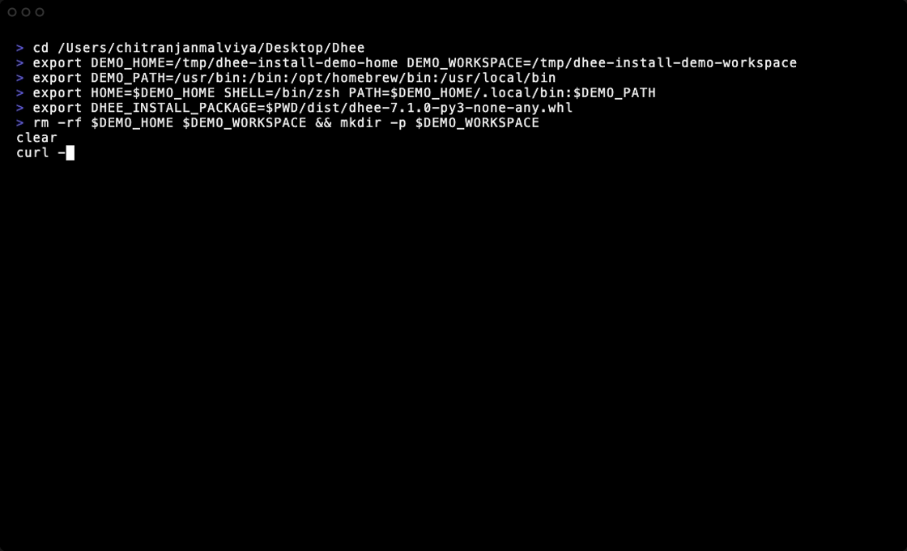

<p align="center">
  
</p>

<h1 align="center">Dhee</h1>

<p align="center">
  <b>World memory for AI agents.</b><br>
  A arc based context compiler for ai agents
</p>

<p align="center">
  <a href="https://pypi.org/project/dhee"></a>
  <a href="https://pypi.org/project/dhee"></a>
  <a href="https://github.com/Sankhya-AI/Dhee/blob/main/LICENSE"></a>
  <a href="benchmarks/longmemeval/"></a>
</p>

---

Dhee gives an agent the bigger story before it takes the next action.

LLMs are powerful, but they still miss the arc. What is the user trying to become? What happened last session? Which decision was already made? Which failure should not be repeated? Which proof is required before touching code?

Dhee stores that story locally and compiles it into the smallest useful context. Not a transcript pile. Not vibes. Memory with shape.

## Install

```bash
pip install dhee
dhee install
```

Or use the one-command installer:

```bash
curl -fsSL https://raw.githubusercontent.com/Sankhya-AI/Dhee/main/install.sh | sh
```

<p align="center">
  
</p>

Wire a repo:

```bash
cd /path/to/repo-or-folder
dhee init
dhee status
dhee ui
```

`dhee init` is the opt-in switch. Run it in the current directory, pass a folder, or pass a git URL:

```bash
dhee init /path/to/folder
dhee init https://github.com/org/repo.git
```

Folders that have not run `dhee init` stay vanilla in Codex and Claude Code.

Shell autocomplete is built in:

```bash
dhee completion --shell zsh
dhee completion --shell bash
dhee completion --shell fish
```

## What Is Dhee?

Dhee is the memory layer agents should have had from day one.

It runs beside the model and answers the questions that raw chat history cannot:

| The agent needs | Dhee gives it |
| --- | --- |
| What matters right now? | A compiled context packet with included and rejected reasons. |
| What happened before? | Durable user, project, repo, scene, and handoff memory. |
| What files are risky? | Repo brain impact analysis, likely tests, owners, routes, and symbols. |
| What should not be used? | Secret filters, privacy classes, supersession, contradiction, and proof gates. |
| What is the larger story? | Series, Seasons, Episodes, Scenes, and SceneCards. |
| Can another agent continue? | Session digests, shared task state, evidence refs, and handoff packets. |

## Context Compiler

Most agents drown in context or starve without it. Dhee does the boring hard part in the middle.

- Reads summarize files instead of dumping them.
- Searches return compact matches with expansion pointers.
- Tool output becomes reusable evidence, not one-turn sludge.
- Task contracts define files, constraints, tests, and proof obligations.
- SceneCards become the default retrieval object.
- Raw transcripts stay out of prompts unless explicitly requested.

The model gets the part of the world it needs, in the form it can use.

## Narrative Memory

This is the new Dhee core.

```text
Series -> Season -> Episode -> Scene -> SceneCard -> MemoryItem
```

In plain English:

- **Series** is the biggest purpose. Example: become a successful CTO.
- **Season** is a period of the story: learning, struggle, first success, downfall, comeback.
- **Episode** is the meaningful arc of a day.
- **Scene** is a bounded work moment with a hero, intent, action, obstacle, result, and outcome.
- **SceneCard** is the retrieval card the agent sees later: compact, evidence-backed, privacy-aware.
- **MemoryItem** is promoted only when the SceneCard is worth keeping long-term.

That story gives the model anticipation. The prior is advisory, never bossy: explicit user intent, facts, privacy, and proof gates win.

## Retrieval That Actually Ranks

Dhee can run model-free, but the production retrieval path is built for serious agent work:

```bash
python3.11 -m pip install "dhee[nvidia,zvec,mcp]"
dhee key set nvidia
```

Current high-quality stack:

- Embedder: `nvidia/llama-nemotron-embed-vl-1b-v2`
- Reranker: `nvidia/llama-3.2-nv-rerankqa-1b-v2`
- Vector backend: `zvec` through `dhee-accel`
- Routine narrative rollups: `google/gemma-4-31b-it`
- Series-level strategic rollups: `moonshotai/kimi-k2.6`

Deterministic filters still go first: secrets, private scenes, contradicted cards, superseded cards, and code-mutation proof gates cannot be talked around by a high similarity score.

## MCP Tools

Add Dhee to any MCP client:

```json
{
  "mcpServers": {
    "dhee": { "command": "dhee-mcp" }
  }
}
```

Scene intelligence tools:

```text
dhee_scene_start
dhee_scene_event
dhee_scene_end
dhee_scene_context
dhee_narrative_prior
```

Core context tools:

```text
dhee_context_bootstrap
dhee_read
dhee_grep
dhee_bash
dhee_context_pack
dhee_scene_search
```

A good agent loop is simple:

```text
bootstrap -> start scene -> gather evidence -> retrieve context -> act -> verify -> end scene -> save digest
```

## Agent Runtime

Dhee now plugs into existing agents with a few lines of code.

If you already have an agent, you keep your provider SDK, model, tools, audio interface, callbacks, and deployment. Dhee adds the missing memory loop:

```text
before run -> inject compact Dhee context
during run -> expose a dhee_memory tool
after run  -> checkpoint what should matter next time
```

Current native integrations:

| Provider | Import | Minimal change |
| --- | --- | --- |
| ElevenLabs voice agents | `from dhee import ElevenLabsAgent` | Add Dhee dynamic variables, client tool, callback wrappers, and post-call checkpointing. |
| Gemini API agents | `from dhee import GeminiAgent` | Pass `config=memory.generate_content_config()` into `client.models.generate_content(...)`. |
| OpenAI Responses API agents | `from dhee import OpenAIAgent` | Spread `**memory.response_create_kwargs(...)` into `client.responses.create(...)`. |

Dhee can also run as a small HTTP sidecar for agents that cannot use local Python or stdio MCP.

```bash
export DHEE_HTTP_TOKEN="dev-token"
export ELEVENLABS_WEBHOOK_SECRET="..."
dhee serve --host 0.0.0.0 --port 8765 --profile elevenlabs
```

Unsigned ElevenLabs post-call webhooks are rejected by default; use `--allow-unsigned-webhooks` only for local development.

The universal runtime surface is intentionally provider-neutral:

```python
import dhee

memory = dhee.Client(user_id="user_123", app_id="elevenlabs:support-agent")
run = memory.run(task="voice support call")
patch = run.before(channel="voice")
run.tool("remember", content="User prefers WhatsApp follow-up.")
run.finish(summary="User asked about refund status.")
```

For an existing ElevenLabs voice agent, the minimal native path is:

```python
from dhee import ElevenLabsAgent

agent = ElevenLabsAgent(
    public_base_url="https://memory.example.com",
    user_id="user_123",
    agent_id="support-agent",
)

conversation = agent.create_conversation(api_key="...")
conversation.start_session()
```

That keeps your ElevenLabs agent, audio interface, and callbacks intact while Dhee adds:

- `ConversationInitiationData(dynamic_variables={...})` with `dhee_context`
- a native `dhee_memory` client tool
- transcript event capture through wrapped callbacks
- post-call checkpoint helpers

If you already construct `Conversation(...)` yourself, make the smaller patch:

```python
memory = ElevenLabsAgent(
    public_base_url="https://memory.example.com",
    user_id="user_123",
    agent_id=agent_id,
)

conversation = Conversation(
    client=elevenlabs,
    agent_id=agent_id,
    config=memory.conversation_initiation_data(),
    client_tools=memory.client_tools(existing_client_tools),
    callback_user_transcript=memory.wrap_user_transcript(on_user_transcript),
    callback_agent_response=memory.wrap_agent_response(on_agent_response),
    audio_interface=audio_interface,
)
```

Install the optional SDK bridge with:

```bash
pip install "dhee[elevenlabs]"
```

For hosted/server-tool deployment, use the profile helper:

```bash
dhee elevenlabs init --public-url https://memory.example.com
```

That prints the dynamic variables, `dhee_memory` server tool, and post-call webhook URL. The flow is:

```text
call start -> {{dhee_context}}
during call -> dhee_memory server tool
call end -> post-call webhook checkpoint
next call -> better injected context
```

The native provider lives at [`dhee.providers.elevenlabs`](dhee/providers/elevenlabs.py) and is exported as `dhee.ElevenLabsAgent` and `dhee.ElevenAgent`.

For an existing Gemini API agent, add Dhee to the existing `generate_content` call:

```python
from google import genai
from dhee import GeminiAgent

client = genai.Client(api_key="...")
memory = GeminiAgent(user_id="user_123", model="gemini-2.5-flash")

response = client.models.generate_content(
    model=memory.model,
    contents="What did I ask you to remember?",
    config=memory.generate_content_config(),
)
```

The config injects Dhee context as a system instruction and adds `memory.dhee_memory` as a Gemini Python function tool. You can also call through Dhee:

```python
response = memory.generate_content(
    "Please remember I prefer concise summaries.",
    client=client,
)
```

The native Gemini provider lives at [`dhee.providers.gemini`](dhee/providers/gemini.py) and is exported as `dhee.GeminiAgent` and `dhee.GeminiAPIAgent`.

For an existing OpenAI Responses API agent, add Dhee to the existing request:

```python
from openai import OpenAI
from dhee import OpenAIAgent

client = OpenAI(api_key="...")
memory = OpenAIAgent(user_id="user_123", model="gpt-4.1")

response = client.responses.create(
    **memory.response_create_kwargs(
        input="What should you remember about me?",
    )
)
```

When the model returns `function_call` items, Dhee can execute them and format Responses API tool outputs:

```python
tool_outputs = memory.function_call_outputs(response)
followup = client.responses.create(
    model=memory.model,
    input=tool_outputs,
    previous_response_id=response.id,
    tools=memory.tools(),
)
```

The native OpenAI provider lives at [`dhee.providers.openai`](dhee/providers/openai.py) and is exported as `dhee.OpenAIAgent` and `dhee.OpenAIResponsesAgent`.

## Repo Brain

Ask: "If I touch this file, what breaks?"

Dhee's repo brain answers with graph-backed evidence:

- impacted files and symbols
- impacted routes and React components
- likely tests to run
- owners from git history
- related failure signatures
- source windows with line numbers

The repo brain is git-SHA scoped and persisted under `.dhee/context/repo_brain/`, so the agent does not rebuild the same understanding every session.

## Why It Feels Different

Normal memory says: "Here are some old notes."

Dhee says:

- this is the user's bigger goal
- this is the current season of work
- this is today's episode
- this scene has these constraints
- these cards are safe to use
- these cards were rejected and why
- this action needs proof before mutation

The result is an agent that feels less random because it can see the arc.

## Benchmarks

On LongMemEval full 500-question recall:

| System | R@1 | R@3 | R@5 | R@10 |
| --- | ---: | ---: | ---: | ---: |
| Dhee | 94.8% | 99.0% | 99.4% | 99.8% |

Reproduction notes and outputs live in [`benchmarks/longmemeval/`](benchmarks/longmemeval/).

## What Ships

The open source package includes the local memory OS, context compiler, DheeFS, MCP servers, CLI, UI, runtime daemon, handoff bus, repo brain, update capsules, narrative scene intelligence, release checks, and proof tooling.

Team governance, hosted dashboards, org policy, and managed source connectors can build on top of these local primitives. Dhee itself is useful without a hosted account.

## Develop

```bash
python3.11 -m pip install -e ".[dev,nvidia,zvec,mcp]"
pytest
```

Focused release checks:

```bash
python -m pytest tests/test_narrative_scene_intelligence.py tests/test_mcp_tools_slim.py tests/test_scene.py tests/test_temporal_scenes.py tests/test_reranker_defaults.py tests/test_nvidia_embedder.py -q
python -m build
python -m twine check dist/*
```

## License

MIT. Built by Sankhya AI Labs.
