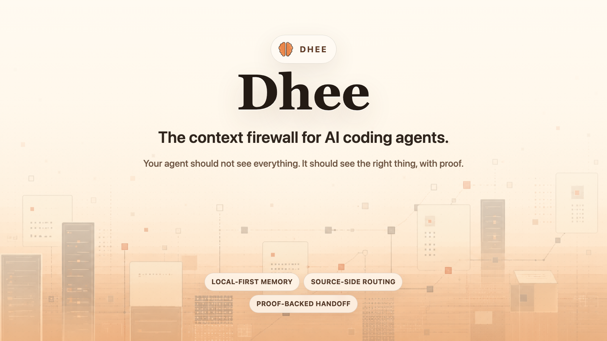

<p align="center">
  
</p>

<h1 align="center">Dhee</h1>

<h3 align="center">The context firewall for AI coding agents.</h3>

<p align="center">
  Dhee decides what your agent should see, remember, forget, compress, and expand each turn.
</p>

<p align="center">
  <a href="https://pypi.org/project/dhee"></a>
  <a href="https://pypi.org/project/dhee"></a>
  <a href="https://github.com/Sankhya-AI/Dhee/blob/main/LICENSE"></a>
  <a href="benchmarks/longmemeval/"></a>
</p>

<p align="center">
  <a href="#why-dhee">Why</a> |
  <a href="#dhee-ui">Dhee UI</a> |
  <a href="#install">Install</a> |
  <a href="#how-it-works">How it works</a> |
  <a href="#integrations">Integrations</a> |
  <a href="#benchmarks">Benchmarks</a> |
  <a href="#faq">FAQ</a> |
  <a href="SECURITY.md">Security</a>
</p>

---

## Why Dhee

Coding agents do not usually fail because the model is too weak. They fail
because context gets messy:

- They reread the same files and logs.
- They carry stale decisions after task pivots.
- They dump huge test output into the model.
- They forget state after compaction or handoff.
- Teams cannot reuse what one agent learned without copying prompt sludge.

Dhee runs locally beside your coding agent and governs context before it becomes
a token problem.

| Without Dhee | With Dhee |
| --- | --- |
| Raw logs, diffs, files, and subagent output flood context. | Large outputs become compact digests with expandable evidence pointers. |
| The agent guesses what still matters after compaction. | Dhee keeps a current state card: goal, facts, decisions, files, tests, next step. |
| Team knowledge lives in random transcripts and markdown files. | Promoted learnings and repo context are reusable across agents with provenance. |
| Memory grows forever. | Dhee scores, decays, tombstones, and gates what gets injected. |
| Switching agents means re-explaining the project. | Claude Code, Codex, Cursor, Gemini CLI, Aider, Cline, Hermes, and MCP clients share one local context layer. |

The promise is simple:

> Your agent should not see everything. It should see the right thing, with proof.

---

## Dhee UI

Run the local Dhee workspace UI. It needs no API key and no connected agent:

```bash
dhee ui
```

<p align="center">
  <video src="docs/dhee-ui-demo.mp4" controls muted loop poster="docs/dhee-ui-demo-poster.png" width="100%"></video>
</p>

<p align="center">
  <a href="docs/dhee-ui-demo.mp4">Watch the 13-second UI demo</a>
</p>

The UI opens on a command center, then lets you inspect:

- Context Firewall: token savings, digests, evidence pointers, expansions, and session history
- Repo Brain: an infinite folders canvas for linked repos, projects, active sessions, tasks, and shared context
- Handoff Hub: resumable task state without replaying the transcript
- Proof Replay: what Dhee injected, hid, digested, expanded, promoted, or rejected
- Learning Inbox: evidence-backed candidate learnings with promote/reject actions
- Portability & Trust: signed `.dheemem` export/import readiness and dry-run inspection

The raw evidence still stays behind `dhee_expand_result(ptr="...")`; the UI
makes the routing and expansion decisions inspectable.

---

## Install

One command:

```bash
curl -fsSL https://raw.githubusercontent.com/Sankhya-AI/Dhee/main/install.sh | sh
```

Or via pip:

```bash
pip install dhee
dhee install
```

Then open your coding agent in a project. Dhee auto-wires supported local
harnesses when detected and keeps its personal state under `~/.dhee`.

Useful first commands:

```bash
dhee status
dhee doctor
dhee ui
dhee handoff
dhee context state --card
dhee runtime status
```

Clean uninstall is part of the trust contract:

```bash
dhee uninstall --yes
```

It stops the daemon, removes Dhee-owned harness wiring and shell PATH blocks,
and deletes the managed local runtime/data directory.

---

## What You Get

**1. Current state, not transcript replay**

Dhee keeps a compact state card for the active task: goal, facts, decisions,
files, tests, evidence pointers, and next step.

```bash
dhee context provision "fix expired-token KeyError"
dhee context state --card
dhee context checkpoint --reason "before compaction"
```

**2. Source-side routing**

Heavy `Read`, `Bash`, `Grep`, and agent results are digested before they flood
the model.

```text
10 MB pytest log -> failing test, first error, summary, head/tail, pointer
large git diff  -> files changed, hunks, additions/deletions, pointer
source file     -> symbols, imports, focus lines, pointer
```

**3. Evidence on demand**

The model can expand raw data only when the digest is not enough:

```text
dhee_expand_result(ptr="B-demo-pytest")
```

Expansion reasons are logged, so Dhee learns which digests need more depth.

**4. Git-shared repo context**

Teams can share decisions and conventions through the repository itself:

```bash
dhee link /path/to/repo
dhee context check --repo /path/to/repo
```

Dhee stores shared context under `<repo>/.dhee/context`, with append-only
entries and conflict detection. No hosted server or org account is required.

**5. Portable local memory**

`.dheemem` packs move Dhee state between machines and harnesses:

```bash
dhee export --format dheemem --output backup.dheemem
dhee import backup.dheemem --format dheemem --strategy dry-run
```

Packs are signed and validated before import.

---

## How It Works

```text
Agent asks for context
        |
        v
Dhee reads current task state, repo context, memories, and tool output
        |
        v
Context firewall decides:
  state  -> compact current truth
  proof  -> pointer-backed evidence
  source -> exact raw expansion only when needed
        |
        v
Agent sees a small, relevant, auditable packet
```

The core interfaces stay small:

```python
from dhee import Dhee

d = Dhee()
d.remember("User prefers FastAPI over Flask")
d.recall("what framework does this project use?")
d.context("fixing the auth bug")
d.checkpoint("Fixed auth bug", what_worked="checked logs", outcome_score=1.0)
```

Every surface uses the same primitives: CLI, Python SDK, Claude Code hooks,
Codex session sync, and MCP tools.

---

## Integrations

| Surface | Dhee support |
| --- | --- |
| Claude Code | Deepest integration: hooks, MCP, handoff, shared tasks, router enforcement. |
| Codex | MCP config, global `AGENTS.md`, server instructions, and session-stream sync. |
| Cursor / Gemini CLI / Cline / Goose | MCP-first integration through `dhee-mcp`. |
| Hermes | Native MemoryProvider, learning import, promotion, and playbook exchange. |
| Aider / other CLIs | CLI, MCP, repo context, and portable `.dheemem` flows. |

MCP config:

```json
{
  "mcpServers": {
    "dhee": { "command": "dhee-mcp" }
  }
}
```

Codex note: Codex does not expose Claude-style pre-tool hooks. Dhee uses the
strongest truthful Codex surfaces available: MCP, `AGENTS.md`, config, server
instructions, and session-log sync.

---

## Benchmarks

Dhee reports LongMemEval retrieval results on the full 500-question set:

| System | R@1 | R@5 | R@10 |
| --- | ---: | ---: | ---: |
| Dhee | 94.8% | 99.4% | 99.8% |
| MemPalace raw | - | 96.6% | - |
| MemPalace hybrid v4 | - | 98.4% | - |
| agentmemory | - | 95.2% | 98.6% |

Stack: NVIDIA `llama-nemotron-embed-vl-1b-v2` embedder plus
`llama-3.2-nv-rerankqa-1b-v2` reranker, top-k 10.

The proof is committed under [`benchmarks/longmemeval/`](benchmarks/longmemeval/):
commands, metrics, and per-question output.

Retrieval is only one piece. Dhee's stronger claim is context governance:
controlling what reaches the model before memory retrieval becomes prompt
pollution.

---

## Public Core and Paid Layer

Public Dhee is MIT and complete for local developer use: memory, router,
handoff, DheeFS, MCP, repo context, `.dheemem`, runtime, security checks, and
replay/report data.

A paid team layer can sit on top for company needs: org dashboards, policy,
audit, SSO/RBAC, fleet health, billing, and governance workflows. The local
developer brain stays useful without it.

---

## FAQ

**Is Dhee another memory database?**

No. Memory is part of Dhee, but the wedge is context governance: deciding what
the model sees now, what stays hidden behind proof pointers, and what should be
forgotten or tombstoned.

**Does it require a server?**

No. Dhee is local-first and uses SQLite by default. Repo-shared context uses git.

**Does it store secrets in the repo?**

It should not. Repo-shared context is meant for decisions and conventions, not
secrets or bulk private data. See [`SECURITY.md`](SECURITY.md).

**Can I inspect or export my data?**

Yes. Dhee exposes local shell/MCP surfaces and signed `.dheemem` export/import.
Clean uninstall is supported.

**Which agent should I use it with first?**

Claude Code gets the deepest routing integration. Codex gets the best available
MCP/session-sync integration. Cursor, Gemini CLI, Cline, Goose, and others work
through MCP.

---

## Contributing

```bash
git clone https://github.com/Sankhya-AI/Dhee.git
cd Dhee
./scripts/bootstrap_dev_env.sh
source .venv-dhee/bin/activate
pytest
```

Full verification:

```bash
./scripts/verify_full_suite.sh
```

---

<p align="center">
  <b>Your agent stops drowning in context.</b>
  <br><br>
  <a href="https://github.com/Sankhya-AI/Dhee">GitHub</a> |
  <a href="https://pypi.org/project/dhee">PyPI</a> |
  <a href="https://github.com/Sankhya-AI/Dhee/issues">Issues</a> |
  <a href="https://sankhyaailabs.com">Sankhya AI</a>
</p>

<p align="center">MIT License - built by Sankhya AI Labs.</p>
