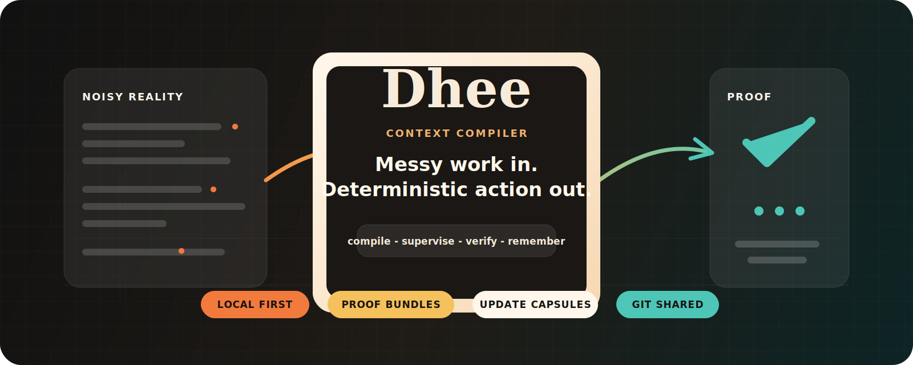
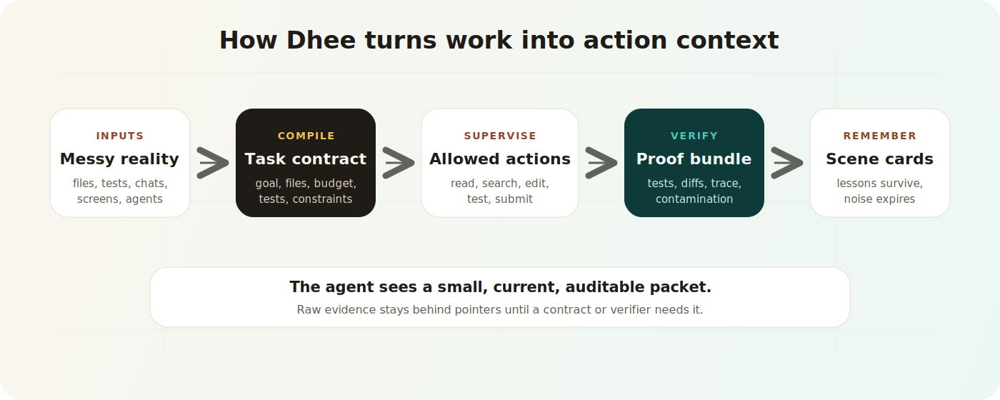

<p align="center">
  
</p>

<h1 align="center">Dhee</h1>

<p align="center">
  <b>Local-first context compiler, supervisor, and proof layer for AI coding agents.</b>
</p>

<p align="center">
  <a href="https://pypi.org/project/dhee"></a>
  <a href="https://pypi.org/project/dhee"></a>
  <a href="https://github.com/Sankhya-AI/Dhee/blob/main/LICENSE"></a>
  <a href="benchmarks/longmemeval/"></a>
</p>

<p align="center">
  <a href="#why">Why</a> |
  <a href="#quick-start">Quick Start</a> |
  <a href="#how-it-works">How It Works</a> |
  <a href="#protected-mode">Protected Mode</a> |
  <a href="#update-capsules">Update Capsules</a>
</p>

---

## Why

AI coding agents do not fail only because the model is weak. They fail because
the working context gets messy: stale decisions, huge logs, repeated file reads,
lost handoffs, private memory mixed with repo context, and unverified edits.

Dhee sits beside the agent and turns that mess into a compact, auditable
working state.

| Without Dhee | With Dhee |
| --- | --- |
| Raw files, logs, diffs, chats, and screenshots flood the prompt. | Dhee compiles ranked context cards with evidence pointers. |
| The agent makes free-form plans and hopes they are safe. | Dhee emits task contracts, allowed actions, verifier cards, and proof bundles. |
| Memory grows until it becomes noise. | Dhee admits, scores, decays, summarizes, and promotes only what survives. |
| Team updates require copying code or long prompts. | Dhee packages reproducible change stories as update capsules. |

The product promise is simple:

> No untracked context. No unproven edit. No repeated preventable failure.

## Quick Start

```bash
curl -fsSL https://raw.githubusercontent.com/Sankhya-AI/Dhee/main/install.sh | sh
cd /path/to/repo
dhee init
dhee status
```

Or install from PyPI:

```bash
pip install dhee
dhee install
```

Open the local workspace:

```bash
dhee ui
```

Core Dhee supports Python 3.9+. MCP server dependencies require Python 3.10+:

```bash
python3.12 -m pip install "dhee[mcp]"
```

## How It Works

<p align="center">
  
</p>

Dhee compiles context like a software build:

1. Read the current task, repo, branch state, tests, memories, agents, and tool output.
2. Produce a deterministic task contract: goal, files, allowed writes, forbidden paths, tests, budget, rollback plan.
3. Supervise every action against the contract.
4. Verify the result with tests, diffs, proof bundles, and contamination checks.
5. Store only compact lessons and scene cards. Raw evidence stays behind pointers.

## Protected Mode

Use protected mode when the agent is allowed to modify code:

```bash
dhee context task create "Fix failing context firewall tests" --repo .
dhee context task enforce deny --repo .
dhee context task activate <task_id> --repo .
dhee doctor contract-runtime --repo .
```

In `deny` mode, Dhee fails closed:

- no active contract, no coding action
- supervisor unavailable, action blocked
- corrupt runtime state, diagnostic surfaced
- proof bundle required before submit

Release gate:

```bash
dhee release check --repo .
```

This refuses release tagging unless `git status` is clean. Release intent can
document scope, but it does not bypass the clean-tree rule.

## Update Capsules

Dhee can turn a completed repo change into a portable update recipe:

```bash
dhee context capsule create --repo . --since HEAD~1
dhee context capsule list --repo .
dhee context capsule show <capsule_id> --repo .
```

Each capsule stores:

- `capsule.md`: before/after story, behavior, tests, reproduction guide
- `capsule.json`: changed paths, hashes, compact hunks, commands, evidence refs

Capsules are not raw memory dumps. Personal context is private by default and
only sanitized lessons can be promoted into shareable repo context.

## Memory Layer

Dhee memory is designed for long-lived developer work:

- temporal scenes from noisy evidence
- hot, warm, and cold tiers
- pointer-backed artifacts, transcripts, screenshots, media, and future wearable streams
- provenance fields for user, agent, app, event, run, memory type, and privacy scope
- context packs that fit a hard token budget

For passive capture, Dhee rejects low-quality UI noise and stores searchable
derivatives instead of raw prompt-heavy media.

## Integrations

| Surface | Support |
| --- | --- |
| Claude Code | hooks, MCP, handoff, shared tasks, router enforcement |
| Codex | MCP config, `AGENTS.md`, server instructions, session-log sync |
| Cursor, Cline, Gemini CLI, Goose | MCP-first integration |
| Hermes | MemoryProvider, learning import, promotion, playbook exchange |
| Git | repo context, update capsules, conflict checks |

MCP config:

```json
{
  "mcpServers": {
    "dhee": { "command": "dhee-mcp" }
  }
}
```

## Useful Commands

```bash
dhee handoff
dhee context state --card
dhee context checkpoint --reason "before compaction"
dhee context check --repo .
dhee doctor
dhee export --format dheemem --output backup.dheemem
dhee import backup.dheemem --format dheemem --strategy dry-run
```

## Benchmarks

Dhee reports LongMemEval retrieval results on the full 500-question set:

| System | R@1 | R@5 | R@10 |
| --- | ---: | ---: | ---: |
| Dhee | 94.8% | 99.4% | 99.8% |
| agentmemory | - | 95.2% | 98.6% |
| MemPalace hybrid v4 | - | 98.4% | - |

Proof and commands live in [`benchmarks/longmemeval/`](benchmarks/longmemeval/).

## Develop

```bash
git clone https://github.com/Sankhya-AI/Dhee.git
cd Dhee
pip install -e ".[dev]"
pytest
```

Full release check:

```bash
python3 -m compileall -q dhee tests
python3 -m pytest -q
python3 -m build
dhee release check --repo .
```

## License

MIT. Built by Sankhya AI Labs.
